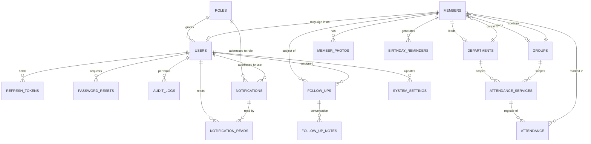

# Database design

PostgreSQL 14+. The full DDL is `server/src/db/migrations/001_init.sql`; this
document explains *why* it is shaped the way it is.

---

## Entity relationship diagram



---

## The tables

### Identity and access

| Table | Purpose |
|---|---|
| `roles` | Five seeded roles. `permissions` is a JSONB array of `resource:action` strings, so a Super Administrator can retune a role without a migration. |
| `users` | A **sign-in**, not a person. Most members never log in; some staff are not members. `member_id` links the two when they are the same person. `department_id` scopes a Department Leader. |
| `refresh_tokens` | Server-side sessions. Only the SHA-256 hash is stored, so a database leak yields no usable sessions. Revocation = setting `revoked_at`. |
| `password_resets` | Single-use, one-hour tokens, hashed the same way. |

**Why users and members are separate.** Conflating them is the most common
mistake in church systems: it forces every volunteer with a login to become a
member record, and it makes deleting a member destroy an account. Keeping them
apart costs one nullable foreign key and removes an entire class of problem.

### The congregation

| Table | Purpose |
|---|---|
| `members` | The heart of the system. Soft-deleted via `deleted_at` — member records are pastoral history and must not vanish from an audit trail on a stray click. |
| `member_photos` | One row per uploaded image. `members.photo_id` points at the current one. |
| `departments` | What a member *does* — choir, ushering, media. |
| `groups` | Where a member *belongs* — cell, prayer group, zone, fellowship. |

`departments.leader_member_id` and `groups.leader_member_id` are added by a
later `ALTER` in the same migration, because departments and members reference
each other and one constraint has to come second.

**Indexes on `members`** are driven by the actual query patterns:

```sql
idx_members_status      -- partial, WHERE deleted_at IS NULL: the default list view
idx_members_department  -- department rosters, leader scoping
idx_members_birth_md    -- EXTRACT(MONTH), EXTRACT(DAY): birthday lookups ignore the year
idx_members_fullname    -- LOWER(first || ' ' || last): name search
```

The birthday index is the interesting one. Birthdays are queried by month and
day irrespective of year, so an index on `date_of_birth` itself would never be
used. Indexing the extracted parts makes the birthday screens fast at any
congregation size.

### Attendance

| Table | Purpose |
|---|---|
| `attendance_services` | One row per gathering. Congregation-wide services leave `department_id` and `group_id` NULL. |
| `attendance` | One row per member per service. `UNIQUE (service_id, member_id)`. |

Two design points carry real weight:

**1. The uniqueness index uses `COALESCE`.**

```sql
CREATE UNIQUE INDEX idx_services_unique ON attendance_services (
  service_date, service_type, COALESCE(department_id, 0), COALESCE(group_id, 0)
);
```

A plain `UNIQUE` constraint would not work: `NULL <> NULL` in SQL, so every
congregation-wide service would be considered distinct and you could register
the same Sunday morning a hundred times.

**2. Absence of a row means "not recorded", never "absent".**

This single rule is what makes the absence engine trustworthy. A church that
records only who attended — extremely common — would otherwise generate an alert
for its entire membership on the first Sunday. See the completeness guard below.

### Follow-ups

| Table | Purpose |
|---|---|
| `follow_ups` | A case. Level 1–3, a status, an assigned officer, a next-contact date. |
| `follow_up_notes` | The conversation. Author, contact method, and the status at the time. |

The duplicate-alert requirement is enforced in the **database**, not in
application code:

```sql
CREATE UNIQUE INDEX idx_followups_one_open_per_member
  ON follow_ups (member_id)
  WHERE status NOT IN ('resolved','unable_to_reach');
```

A member can have many historical cases but only one open at a time. Two
concurrent scans, or a scan racing a worker clicking "Start Follow-Up", cannot
produce a duplicate — one of them gets a constraint violation, which the error
translator turns into *"This member already has an open follow-up."*

### Notifications

| Table | Purpose |
|---|---|
| `notifications` | Addressed to **either** one user **or** one role, enforced by a CHECK constraint. |
| `notification_reads` | Read state per user, so a pastor marking a role-wide alert as read does not hide it from the administrator. |

Repeat suppression:

```sql
CREATE UNIQUE INDEX idx_notifications_dedupe ON notifications (dedupe_key)
  WHERE dedupe_key IS NOT NULL;
```

Absence alerts use `absence:<memberId>:<level>:<roleId>`, birthdays use
`birthday:<memberId>:<date>:<offset>:<roleId>`. The nightly job can run a
thousand times and announce each thing exactly once.

> **Note for anyone extending this:** the index is *partial*, so an `ON CONFLICT`
> targeting it **must repeat the predicate** —
> `ON CONFLICT (dedupe_key) WHERE dedupe_key IS NOT NULL DO NOTHING`. Without it
> PostgreSQL raises *"there is no unique or exclusion constraint matching the
> ON CONFLICT specification"*.

### Supporting tables

| Table | Purpose |
|---|---|
| `birthday_reminders` | `UNIQUE (member_id, birthday_date, days_before)` makes the daily job idempotent. |
| `audit_logs` | Append-only. Keeps a denormalised copy of the actor's email so the trail survives account deletion. |
| `system_settings` | Key/JSONB value, so a setting can be a string, a number, or an array of reminder offsets. |

---

## Conventions applied throughout

**Surrogate keys everywhere.** Every table uses `BIGSERIAL`. Natural keys users
actually type (`member_code`, `roles.name`, `system_settings.key`) carry UNIQUE
constraints instead, so they can be renamed without breaking references.

**CHECK constraints, not ENUM types.** Adding a value to a CHECK is a cheap
`ALTER`; adding one to a PostgreSQL ENUM historically required careful migration
ordering. Service types and statuses will grow over a church's life.

**Explicit `ON DELETE` on every foreign key.** Data a member merely points at
(department, group) uses `SET NULL`. Data that only exists because of its parent
(attendance rows, follow-up notes) uses `CASCADE`. Nothing is left to the
default.

**`updated_at` maintained by trigger**, not by the application. A shared
`set_updated_at()` trigger function means a stray manual `UPDATE` in psql cannot
leave a stale timestamp.

**Calendar dates stay strings.** `node-postgres` returns `DATE` columns as JS
`Date` objects in the server's local timezone, which silently shifts a birthday
by a day for anyone west of UTC. `config/db.ts` overrides the type parser for
OID 1082 so dates arrive as `YYYY-MM-DD` and stay that way through the API and
into the browser.

---

## The absence query, explained

The engine reads at most a dozen finalised tracked services and all attendance
marks on them in **two** queries, then walks the streak in memory:

```sql
-- 1. The candidate services, with register completeness
WITH active_count AS (
  SELECT COUNT(*)::int AS n FROM members
   WHERE deleted_at IS NULL AND membership_status = 'active'
)
SELECT s.id, s.service_date, COUNT(a.id)::int AS marked,
       (SELECT n FROM active_count) AS active_members
  FROM attendance_services s
  LEFT JOIN attendance a ON a.service_id = s.id
 WHERE s.is_finalized AND s.service_type = ANY($1)
   AND s.department_id IS NULL AND s.group_id IS NULL
 GROUP BY s.id ORDER BY s.service_date DESC LIMIT $2;

-- 2. Every mark on those services
SELECT member_id, service_id, status FROM attendance WHERE service_id = ANY($1);
```

`marked / active_members >= 0.4` is the **completeness guard**. A register
covering under 40% of the active roll is treated as informational and skipped
entirely, which is what distinguishes "nobody recorded this week" from "this
person genuinely did not come".

The walk itself is deliberately in TypeScript rather than a window function: it
is a small ordered scan (members × ~12 services) and the four exception rules —
joined-after, excused-resets, missing-means-unrecorded, incomplete-register — are
far clearer as readable branches than as nested `CASE` expressions. See
`server/src/services/absence.service.ts`.

---

## Convenience view

`v_member_attendance_summary` encapsulates per-member attendance totals and last
present date, so ad-hoc reporting and the application agree on one definition
rather than each writing their own aggregate.

---

## Scaling notes

Sized for hundreds to a few thousand members, which is what the brief asks for.
Beyond roughly 20,000 members:

- Partition `attendance` by `service_date` (yearly ranges).
- Replace the `LIKE '%term%'` member search with a `pg_trgm` GIN index, or
  `tsvector` full text.
- Materialise the dashboard aggregates on a refresh schedule instead of
  computing them per request.

None of these are needed at the target size, and adding them early would trade
clarity for a performance problem the church does not have.
